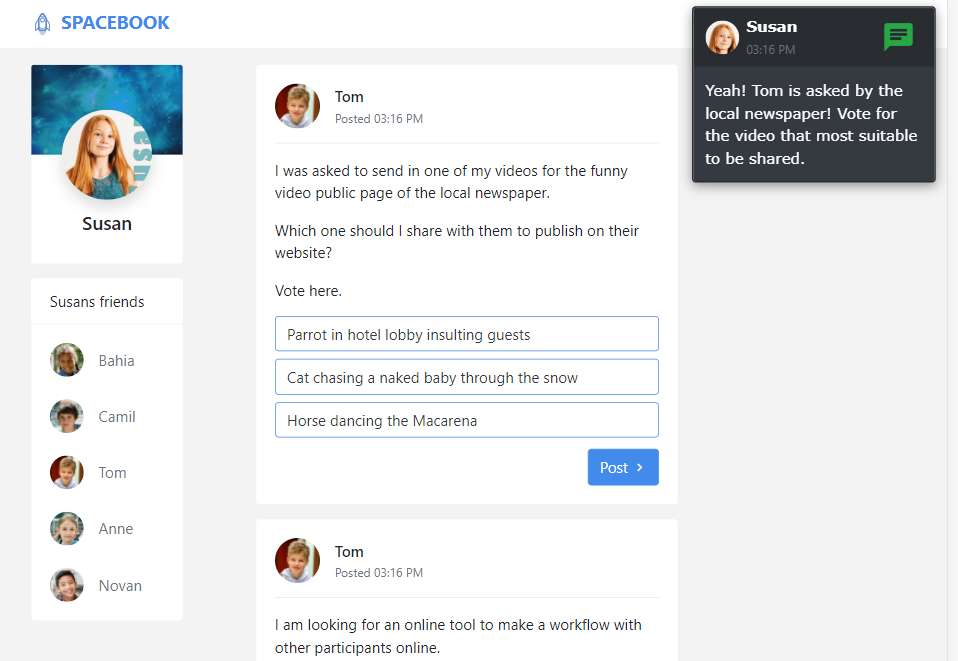

## Diggel - introduction

Diggel (**Dig**itale **gel**etterdheid - digital literacy) is a prototype that is created by Cito in collaboration with the University of Twente (Netherlands). It presents items[1](#fn1) in the context of simulated social media and content creation apps. 

The main 4 apps Diggel encompasses are:
- *Spacebook*: social media context
- *Spacegram*: social media context
- *Webspace*: website authoring context
- *Spacetalk*: slide show (presentation) authoring context

Each context is an different Angular application deployed on a subsite of the same domain.
A fifth application named *Diggel* contains the login, start and end pages and is deployed in the root.

## Demo

A demo application is deployed [here](https://diggel.azurewebsites.net/).
The code 55555 can be used to login as an demo user.
Other than using the system as a regular user (a learner), a demo user has a slightly different experience:
- A demo user can navigate through items[1](#fn1)
- The demo user's responses and log are sent to the web browser console instead of the backend
- A demo user can choose to start an application (regular users are assigned to 2 application, e.g. first spacebook then webspace)

# Getting started

### Frontend

The frontend application is wrapped into a Cordova Android app for real deliveries but can run in the browser too.

Steps to get stuff working:
- `npm i` in the frontend folder to install dependencies
- `npm run start:spacebook-nobackend` - starts the apps without a backend

[More info about the frontend](/frontend)

## Backend
- install [the latest dotnet](https://dotnet.microsoft.com/download/dotnet/5.0)
- `dotnet restore` in the backend folder
- add an appsettings.local.json file and add 
    - AppSettings:backoffice_admin_username": "--some username--",
    - AppSettings:backoffce_admin_password": "--some password--"
- optionally change the database from memory to mongo to use a mongo database. In that case your should make sure the connectionString is pointing to an existing mongo database.

[More info about the backend](/backend)
***
### Footnotes
<a name="fn1">1</a>: An 'item' in this context is educational lingo for a test question or assignment.